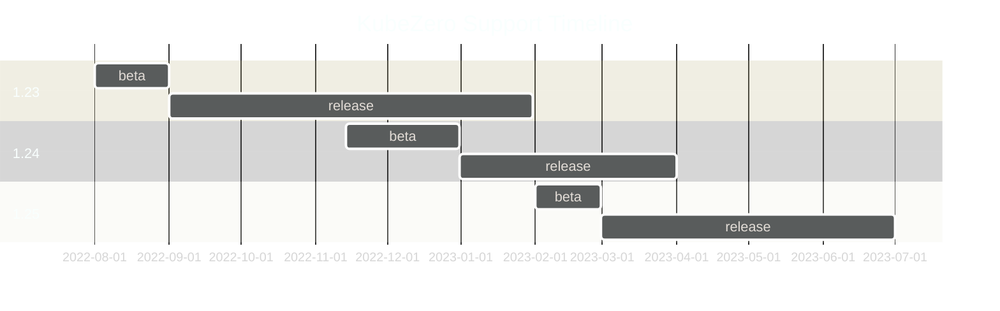

KubeZero - Zero Down Time Kubernetes platform
========================
KubeZero is a Kubernetes distribution providing an integrated container platform so you can focus on your applications.

# Design philosophy

- Cloud provider agnostic, bare-metal/self-hosted
- Focus on security and simplicity before feature bloat
- No vendor lock in, most components are optional and could be exchanged
- Organic Open Source / open and permissive licenses over closed-source solutions
- No premium services / subscriptions required
- Staying and contributing back to upstream projects as much as possible
- Corgi approved :dog:

# Architecture

# Version / Support Matrix
KubeZero releases track the same *minor* version of Kubernetes.  
Any 1.21.X-Y release of Kubezero supports any Kubernetes cluster 1.21.X.

KubeZero is distributed as a collection of versioned Helm charts, allowing custom upgrade schedules and module versions as needed.

[Upstream release policy](https://kubernetes.io/releases/)

# Components

## OS
- all nodes are based on Alpine V3.15
- 2 GB encrypted root filesystem
- no 3rd party dependencies at boot ( other than container registries )
- minimal attack surface
- extremely small memory footprint / overhead

## Container runtime
- cri-o rather than Docker for improved security and performance

## Control plane
- all Kubernetes components compiled against Alpine OS using `buildmode=pie`
- support for single node control plane for small clusters / test environments to reduce costs
- access to control plane from within the VPC only by default ( VPN access required for Admin tasks )
- controller nodes are used for various platform admin controllers / operators to reduce costs and noise on worker nodes

## GitOps
- cli / cmd line install
- optional full ArgoCD support and integration
- fuse device plugin support to build containers as part of a CI pipeline leveraging rootless podman build agents

## AWS integrations
- IAM roles for service accounts allowing each pod to assume individual IAM roles
- access to meta-data services is blocked all workload containers on all nodes
- all IAM roles are maintained via CloudBender automation
- aws-node-termination handler integrated
- support for spot instances per worker group incl. early draining etc.
- support for [Inf1 instances](https://aws.amazon.com/ec2/instance-types/inf1/) part of [AWS Neuron](https://aws.amazon.com/machine-learning/neuron/).

## Network
- Multus support for multiple network interfaces per pod, eg. additional AWS CNI
- Calico using VxLAN incl. increased MTU  
allows flexible / more containers per worker node compared to eg. AWS VPC CNI
- isolates container traffic from VPC by using VxLAN overlay
- no restrictions on IP space / sizing from the underlying VPC architecture

## Storage
- flexible EBS support incl. zone awareness
- EFS support via automated EFS provisioning for worker groups via CloudBender automation
- local storage provider (OpenEBS LVM) for latency sensitive high performance workloads
- CSI Snapshot controller and Gemini snapshot groups and retention

## Ingress
- AWS Network Loadbalancer and Istio Ingress controllers  
- no additional costs per exposed service
- real client source IP available to workloads via HTTP header and access logs
- ACME SSL Certificate handling via cert-manager incl. renewal etc.
- support for TCP services
- optional rate limiting support 
- optional full service mesh

## Metrics
- Prometheus support for all components
- automated service discovery allowing instant access to common workload metrics
- pre-configured Grafana dashboards and alerts
- Alertmanager events via SNSAlertHub to Slack, Google, Matrix, etc.

## Logging
- all container logs are enhanced with Kubernetes and AWS metadata to provide context for each message
- flexible ElasticSearch setup, leveraging the ECK operator, for easy maintenance & minimal admin knowledge required, incl. automated backups to S3
- Kibana allowing easy search and dashboards for all logs, incl. pre configured index templates and index management
- [fluentd-concerter](https://git.zero-downtime.net/ZeroDownTime/container-park/src/branch/master/fluentd-concenter) service providing queuing during highload as well as additional parsing options
- lightweight fluent-bit agents on each node requiring minimal resources forwarding logs secure via TLS to fluentd-concenter
