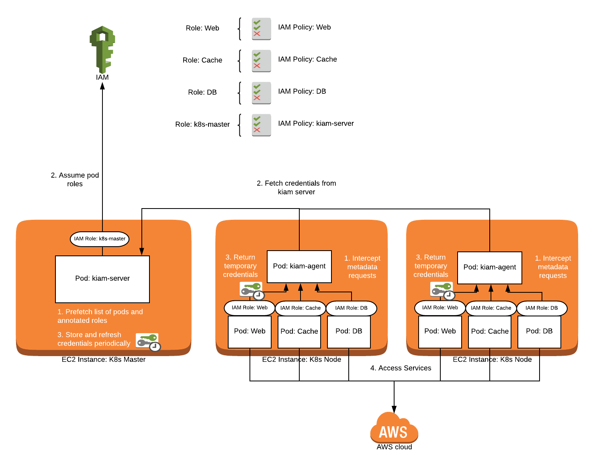

# kubezero-kiam

  

KubeZero Umbrella Chart for Kiam

**Homepage:** <https://kubezero.com>

## Maintainers

| Name | Email | Url |
| ---- | ------ | --- |
| Quarky9 |  |  |

## Requirements

Kubernetes: `>= 1.18.0`

| Repository | Name | Version |
|------------|------|---------|
| https://cdn.zero-downtime.net/charts/ | kubezero-lib | >= 0.1.3 |
| https://uswitch.github.io/kiam-helm-charts/charts/ | kiam | 6.0.0 |

## KubeZero default configuration
We run agents on the controllers as well, so we force eg. ebs csi controllers and others to assume roles etc.
This means we need to run kiam containers on the controllers using `hostnetwork: true`.
Therefore we also change the default port from 443 to 6444 to not collide with the potential api-server port on the controllers.
Make sure any firewall rules between controllers and workers are adjusted accordingly.

## Kiam Certificates
The required certificates for Kiam server and agents are provided by a local cert-manager, which is configured to have a cluster local self-signing CA as part of the KubeZero platform. 
[Kiam TLS Config](https://github.com/uswitch/kiam/blob/master/docs/TLS.md#cert-manager) 
[KubeZero cert-manager](../kubezero-cert-manager/README.md)

## Metadata restrictions
Some services require access to some basic AWS information. One example is the `aws-ebs-csi` controller. 
By default all access to the meta-data service is blocked, expect for: 

- `/latest/meta-data/instance-id`
- `/latest/dynamic/instance-identity/document`

## Values

| Key | Type | Default | Description |
|-----|------|---------|-------------|
| annotateKubeSystemNameSpace | bool | `false` |  |
| kiam.agent.allowRouteRegexp | string | `"^/latest/(meta-data/instance-id|dynamic)"` |  |
| kiam.agent.gatewayTimeoutCreation | string | `"5s"` |  |
| kiam.agent.host.interface | string | `"cali+"` |  |
| kiam.agent.host.iptables | bool | `false` |  |
| kiam.agent.log.level | string | `"info"` |  |
| kiam.agent.priorityClassName | string | `"system-node-critical"` |  |
| kiam.agent.prometheus.servicemonitor.enabled | bool | `false` |  |
| kiam.agent.prometheus.servicemonitor.interval | string | `"30s"` |  |
| kiam.agent.prometheus.servicemonitor.labels.release | string | `"metrics"` |  |
| kiam.agent.resources.limits.memory | string | `"64Mi"` |  |
| kiam.agent.resources.requests.cpu | string | `"50m"` |  |
| kiam.agent.resources.requests.memory | string | `"16Mi"` |  |
| kiam.agent.sslCertHostPath | string | `"/etc/ssl/certs"` |  |
| kiam.agent.tlsCerts.caFileName | string | `"ca.crt"` |  |
| kiam.agent.tlsCerts.certFileName | string | `"tls.crt"` |  |
| kiam.agent.tlsCerts.keyFileName | string | `"tls.key"` |  |
| kiam.agent.tlsSecret | string | `"kiam-agent-tls"` |  |
| kiam.agent.tolerations[0].effect | string | `"NoSchedule"` |  |
| kiam.agent.tolerations[0].key | string | `"node-role.kubernetes.io/master"` |  |
| kiam.agent.tolerations[1].effect | string | `"NoSchedule"` |  |
| kiam.agent.tolerations[1].key | string | `"kubezero-workergroup"` |  |
| kiam.agent.tolerations[1].operator | string | `"Exists"` |  |
| kiam.agent.updateStrategy | string | `"RollingUpdate"` |  |
| kiam.enabled | bool | `true` |  |
| kiam.server.assumeRoleArn | string | `""` | kiam server IAM role to assume, required as we run the agents next to the servers normally, eg. arn:aws:iam::123456789012:role/kiam-server-role |
| kiam.server.deployment.enabled | bool | `true` |  |
| kiam.server.deployment.replicas | int | `1` |  |
| kiam.server.log.level | string | `"info"` |  |
| kiam.server.nodeSelector."node-role.kubernetes.io/master" | string | `""` |  |
| kiam.server.priorityClassName | string | `"system-cluster-critical"` |  |
| kiam.server.prometheus.servicemonitor.enabled | bool | `false` |  |
| kiam.server.prometheus.servicemonitor.interval | string | `"30s"` |  |
| kiam.server.prometheus.servicemonitor.labels.release | string | `"metrics"` |  |
| kiam.server.resources.limits.memory | string | `"128Mi"` |  |
| kiam.server.resources.requests.cpu | string | `"50m"` |  |
| kiam.server.resources.requests.memory | string | `"64Mi"` |  |
| kiam.server.service.port | int | `6444` |  |
| kiam.server.service.targetPort | int | `6444` |  |
| kiam.server.sslCertHostPath | string | `"/etc/ssl/certs"` |  |
| kiam.server.tlsCerts.caFileName | string | `"ca.crt"` |  |
| kiam.server.tlsCerts.certFileName | string | `"tls.crt"` |  |
| kiam.server.tlsCerts.keyFileName | string | `"tls.key"` |  |
| kiam.server.tlsSecret | string | `"kiam-server-tls"` |  |
| kiam.server.tolerations[0].effect | string | `"NoSchedule"` |  |
| kiam.server.tolerations[0].key | string | `"node-role.kubernetes.io/master"` |  |
| kiam.server.updateStrategy | string | `"RollingUpdate"` |  |
| kiam.server.useHostNetwork | bool | `true` |  |

## Debugging
- Verify iptables rules on hosts to be set by the kiam agent: 
  `iptables -L -t nat -n --line-numbers` 
  `iptables -t nat -D PREROUTING <wrong rule>`

## Resources
- https://github.com/uswitch/kiam
- https://www.bluematador.com/blog/iam-access-in-kubernetes-kube2iam-vs-kiam
- [Grafana Dashboard](https://raw.githubusercontent.com/uswitch/kiam/master/docs/dashboard-prom.json)

